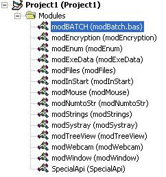

## a 14 Handy modules about different subjects

### Description

Read the README file for some information about almost ALL functions subs and properities in the modules.

YOU CAN USE THIS CODE FOR FREE

AND HAVE FUN!!! :)

modBatch: ### This module is here to use the batch language in visualbasic ###

modEncryption: ### Some encryption methods ###

modEnum: ### Originally made for all enum functions, but only 1 is in there ###

modExeData: ### Module to add files of 3GB or lower to an EXE, and to read from it ###

modFiles: ### I don't use it often, it is used for basic file handling ###

modInStart: ### start your program automatically when the computer starts ###

modMouse: ### I don't think I have to explain this ###

modNumtoStr: ### Changes an number (50) to an ascii-string(in hex: "00 00 00 32") ###

modStrings: ### All string-related functions ###

modSysTray: ### Add your program to the systemtray ###

modTreeView: ### easily edit treeview ###

modWebcam: ### Add pictures directly from the webcam to your picturebox ###

modWindows ### some apis about hwnds ###

Specialapi: VERY BIG, all catagories not nice code
 
### More Info
 

             |
---                |---
**Submitted On**   |2007-03-26 07:44:54
**By**             |[Aston Flapper](https://github.com/Planet-Source-Code/PSCIndex/blob/master/ByAuthor/aston-flapper.md)
**Level**          |Intermediate
**User Rating**    |4.7 (28 globes from 6 users)
**Compatibility**  |VB 6\.0
**Category**       |[VB function enhancement](https://github.com/Planet-Source-Code/PSCIndex/blob/master/ByCategory/vb-function-enhancement__1-25.md)
**World**          |[Visual Basic](https://github.com/Planet-Source-Code/PSCIndex/blob/master/ByWorld/visual-basic.md)
**Archive File**   |[a\_14\_Handy2056213262007\.zip](https://github.com/Planet-Source-Code/aston-flapper-a-14-handy-modules-about-different-subjects__1-68220/archive/master.zip)

